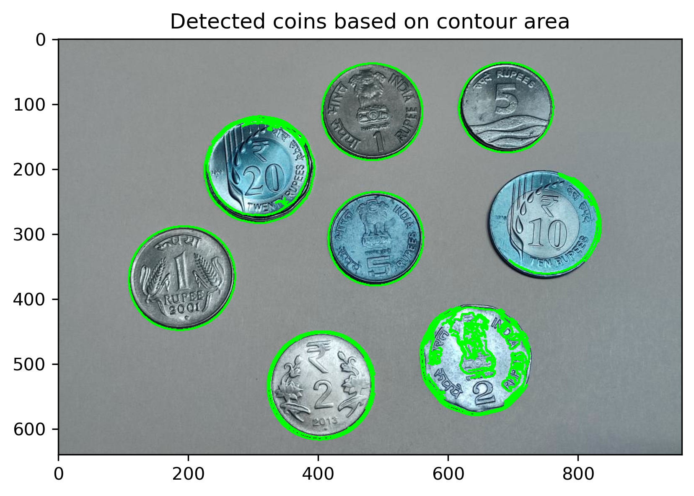
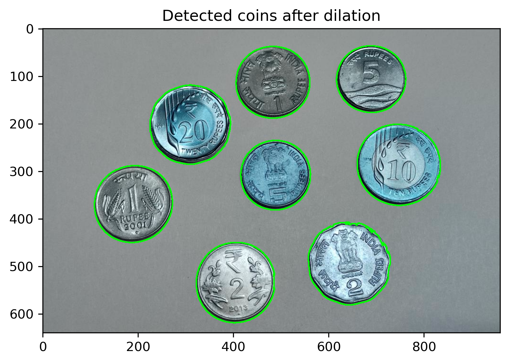

# VR Assignment1 

## Part 1: Coin Detection, Segmentation, Counting

### How to Run the Code
1. Clone the Repository:
   Clone this repository to your local machine.

   git clone https://github.com/yourusername/coin-detection.git

2. Install Dependencies:
   Ensure you have Python installed. Then, install the required dependencies using pip:

    pip3 install opencv-python-headless matplotlib numpy

3.Run the Script:
  Place your coin images in the ./imgs/ folder (e.g., coins.jpg). Then, run the script:

    python3  coin_tasks.py

4. View Results:
   The script will display the results in separate windows using Matplotlib. Close each window to proceed to the next step.

### Methods Chosen
1. Edge Detection:
   The Canny edge detection algorithm is used to detect the edges of the coins in the image. This helps in identifying the boundaries of the coins.

2. Region-Based Segmentation:
   Contours are extracted from the edges, and only those with an area greater than a specified threshold (min_coin_area) are considered valid coins. Each valid coin is then segmented and displayed individually.

3. Dilation for Coin Counting:
   Dilation is applied to the edges to merge nearby edges and fill small gaps. This ensures that overlapping or closely placed coins are counted correctly.

### Results and Observations
1. Edge Detection:
The Canny edge detection successfully identifies the edges of the coins. However, some noise or small edges may also be detected.

2. Region-Based Segmentation:
By filtering contours based on area, only valid coins are segmented. Still there is a lot of noise that can be reduced by dilation of edges as dilation reduces the contour area threfore filtering it out.

3. Coin Counting:
Dilation helps in merging nearby edges, this reduces the contour area. This helps filter out noisy contours . The final count of coins is printed in the console.

### Visual Outputs
1. Detected Coins Using Canny Edge Detection

3. Detected Coins Based on Contour Area

4. Result of Dilation

8. Detected Coins After Dilation

