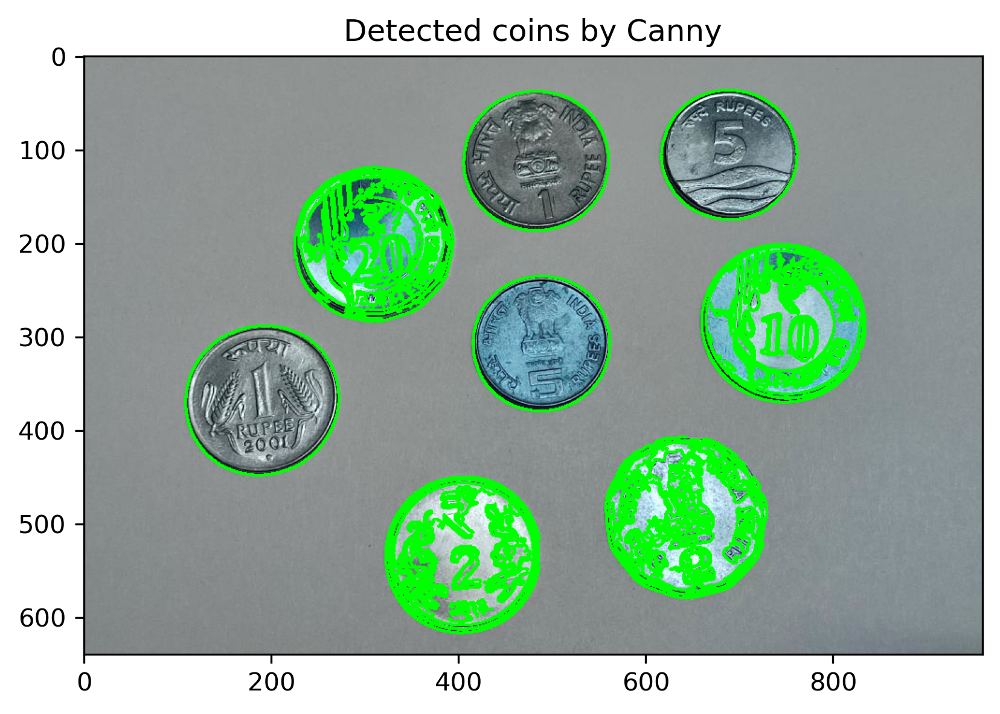
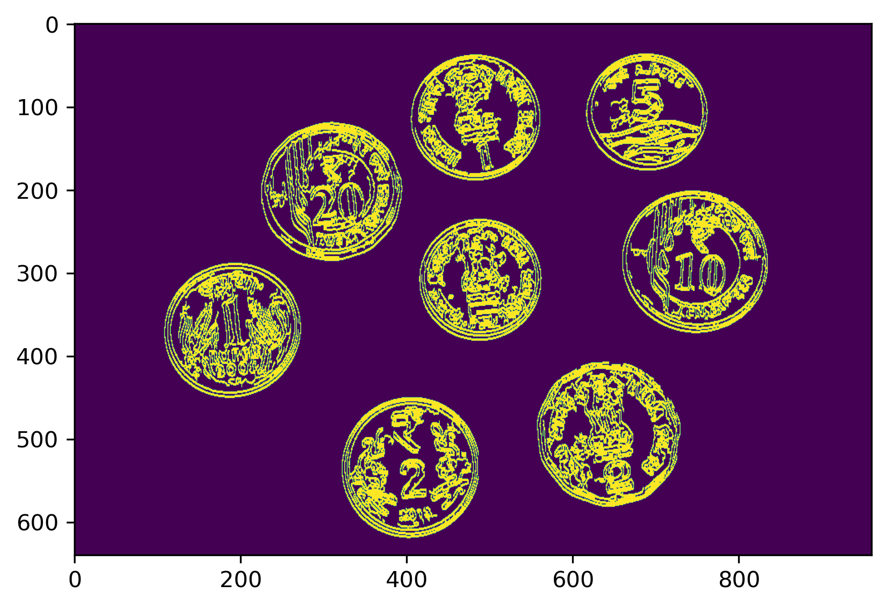
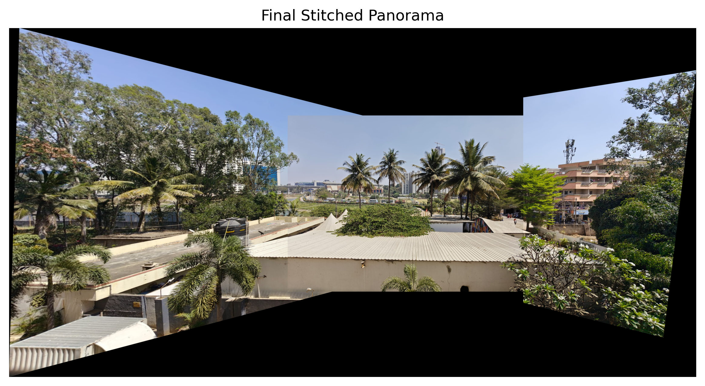

# VR Assignment1

## Part 1: Coin Detection, Segmentation, Counting

### How to Run the Code
1. Clone the Repository:
   Clone this repository to your local machine.

   ```bash
   git clone https://github.com/yourusername/coin-detection.git
   ```

2. Install Dependencies:
   Ensure you have Python installed. Then, install the required dependencies using pip:

   ```bash
   pip3 install opencv-python-headless matplotlib numpy
   ```

3. Run the Script:
   Place your coin images in the `./imgs/` folder (e.g., `coins.jpg`). Then, run the script:

   ```bash
   python3 coin_tasks.py
   ```

4. View Results:
   The script will display the results in separate windows using Matplotlib. Close each window to proceed to the next step.

### Methods Chosen
1. **Edge Detection:**
   The Canny edge detection algorithm is used to detect the edges of the coins in the image. This helps in identifying the boundaries of the coins.

2. **Region-Based Segmentation:**
   Contours are extracted from the edges, and only those with an area greater than a specified threshold (`min_coin_area`) are considered valid coins. Each valid coin is then segmented and displayed individually.

3. **Dilation for Coin Counting:**
   Dilation is applied to the edges to merge nearby edges and fill small gaps. This ensures that overlapping or closely placed coins are counted correctly.

### Results and Observations
1. **Edge Detection:**
   The Canny edge detection successfully identifies the edges of the coins. However, some noise or small edges may also be detected.

2. **Region-Based Segmentation:**
   By filtering contours based on area, only valid coins are segmented. Still, there is a lot of noise that can be reduced by dilation of edges as dilation reduces the contour area, therefore filtering it out.

3. **Coin Counting:**
   Dilation helps in merging nearby edges, which reduces the contour area. This helps filter out noisy contours. The final count of coins is printed in the console.

### Visual Outputs
1. **Detected Coins Using Canny Edge Detection**  
   

2. **Detected Coins Based on Contour Area**  
   

3. **Result of Dilation**  
   

4. **Detected Coins After Dilation**  
   

## Part 2: Keypoint Extraction and Image Stitching

### Installation
1. Ensure you have Python installed along with the following dependencies:

   ```bash
   pip install opencv-python numpy matplotlib
   ```

2. **Running the Code**
   
3. Place the images to be stitched inside the `imgs/` folder.

4. Run the script:

   ```bash
   python3 main.py
   ```

   The outputs, including detected keypoints and the final stitched panorama, will be saved inside the `imgs/` folder.

### Methodology

1. **Feature Detection**
   * Uses the SIFT (Scale-Invariant Feature Transform) algorithm to extract keypoints and descriptors from the images.
   * Features are matched using a Brute-Force Matcher (BFMatcher) with K-Nearest Neighbors (KNN).

2. **Image Stitching**
   * Finds correspondences between images using feature matching.
   * Computes homography transformation using RANSAC to align images.
   * Uses perspective warping to blend images into a panorama.

### Results

1. **Keypoint Detection**  
   Detected keypoints in input images:  
   

2. **Final Stitched Panorama**  
   Result after stitching images together:  
   

## Issues Faced and Trials Performed

### Issues Faced
1. **Noise in Edge Detection:** Some images had a lot of background noise, which led to incorrect coin boundary detection.
2. **Small Contour Detection:** Initial trials resulted in detecting small contours as coins, requiring contour area filtering.
3. **Overlapping Coin Contours:** Closely placed coins merged into one due to improper thresholding and dilation settings.
4. **Feature Matching Errors in Stitching:** Some images failed to stitch correctly due to insufficient or poorly matched keypoints.
5. **Lighting Variations:** Uneven lighting in images caused inconsistent feature extraction, affecting both coin detection and image stitching.

### Trials Performed
1. **Varying Canny Thresholds:** Adjusted the lower and upper threshold values to reduce false edges.
2. **Experimented with Morphological Transformations:** Applied erosion before dilation to improve coin separation.
3. **Homography Parameter Tuning:** Adjusted RANSAC parameters to improve stitching accuracy.
4. **Preprocessed Images for Stitching:** Applied histogram equalization and Gaussian smoothing to improve feature detection.

### Observations That Helped Resolve Issues
1. **Contour Area Based Filtering:** In Coin Detection, as the canny result is very noisy even after varying parameters, filtering based on area of the contours proved to be much better.
2. **Overlap in Images for Panaroma:** The images selected for panaroma needed to have significant overlap > 30% to get good keypoints and proper matching.
3. **Re-Computation of Keypoints:** The keypoints needed to be recomputed over the stitched base image with the left image before stitching with the right one to get expected result.

This experimentation helped refine the final methodology and improve detection accuracy.

